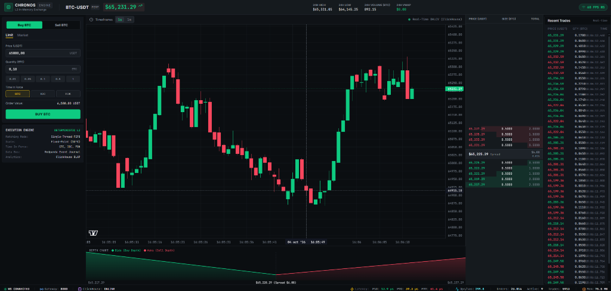
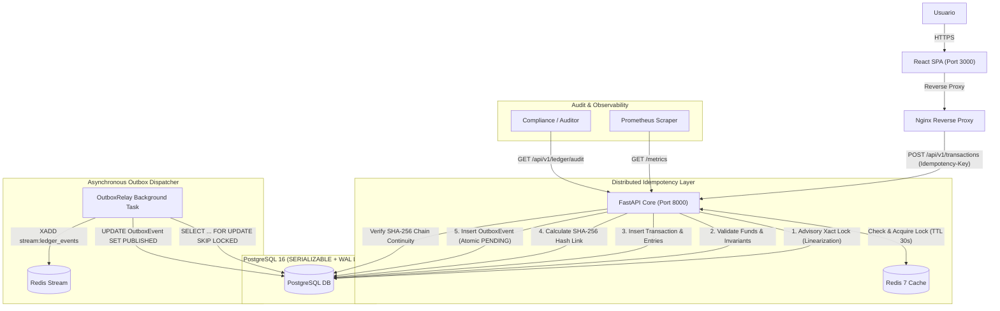

# Aegis Ledger

<p align="center">
  
  
  
  
  
  
  
  
  
  
</p>



---

## 1. Executive Summary

**Aegis Ledger** is a distributed, immutable financial accounting engine engineered for high-throughput institutional settlement, sovereign auditing, and zero data-loss resilience. It combines classical double-entry accounting with modern distributed systems primitives:

* **Double-Entry Bookkeeping**: Strict zero-sum balance invariant ($\sum \text{Debits} - \sum \text{Credits} = 0$). All monetary values are represented as positive 64-bit integers in minor currency units (cents, satoshis, etc.) to completely eliminate floating-point drift.
* **Strict Serializable Isolation**: Configured on PostgreSQL 16 with SSI (Serializable Snapshot Isolation) and advisory transaction locks to eliminate write skew, phantom reads, and concurrent double-spending.
* **Resilient Retry Engine**: Intercepts SQLSTATE `40001` serialization collisions and applies exponential backoff with randomized full jitter.
* **Distributed Idempotency Layer**: Redis-backed distributed lock with 2-phase state machine (`IN_PROGRESS` $\rightarrow$ `COMPLETED`) ensuring at-most-once execution under extreme network retries.
* **Cryptographic SHA-256 Audit Chain**: Every transaction canonically hashes its full payload together with the `current_hash` of the preceding journal entry, creating a tamper-evident audit ledger verifiable from genesis.
* **Transactional Outbox & Redis Streams**: Atomic persistence of domain events within the same ACID boundary as journal seats, dispatched asynchronously via `SELECT ... FOR UPDATE SKIP LOCKED` to Redis Streams.
* **Immutable Accounting Reversals (Storno)**: Errors and adjustments are corrected strictly through compensating contra-entries; historical transactions and ledger states are permanently immutable.
* **Production Observability**: Native Prometheus exposition endpoint (`/metrics`) monitoring transaction throughput, fine-grained latency histograms, serialization retry contention, idempotency cache hits, and outbox queue depth.

---

## 2. Distributed Architecture



---

## 3. Mathematical & Distributed Guarantees

### 3.1 The Zero-Sum Invariant
Every transaction comprises $n \ge 2$ entries. With entry amounts $a_i \in \mathbb{N}^+$ and directions $d_i \in \{\text{DEBIT}, \text{CREDIT}\}$:
$$\sum_{i: d_i = \text{DEBIT}} a_i - \sum_{i: d_i = \text{CREDIT}} a_i = 0$$
Any journal submission where net balance deviates from zero is rejected with `UnbalancedTransactionError` prior to database execution.

### 3.2 Serializable Collision Retry Mechanism
PostgreSQL detects serialization anomalies through SIREAD locks. When concurrent transactions exhibit rw-antidependency cycles, PostgreSQL terminates one with `SQLSTATE 40001` (`serialization_failure`). 

The `@with_serialization_retry` decorator catches these errors and re-executes the transaction with truncated exponential backoff and randomized decorrelated jitter:
$$t_{\text{sleep}} = \min(t_{\text{max}}, t_{\text{base}} \times 2^{\text{attempt}-1}) + \text{Uniform}(0, t_{\text{base}})$$

### 3.3 Continuous Cryptographic Hash Chaining
Transactions are linked into a sovereign immutable blockchain ledger. For transaction $k$:
$$H_0 = 0000000000000000000000000000000000000000000000000000000000000000_{64}$$
$$H_k = \text{SHA-256}\Big( H_{k-1} \,\|\, \text{CanonicalJSON}(T_k) \Big)$$
Tampering with any stored value, balance, or direction invalidates $H_k$ and breaks all subsequent links ($H_{k+1}, \dots, H_N$). The `AuditService` detects fraud deterministically.

---

## 4. Telemetry & Metrics (Prometheus)

Exposed at `GET /metrics` in standard OpenMetrics / Prometheus exposition format:

| Metric Name | Type | Description / Labels |
|---|---|---|
| `ledger_transactions_total` | Counter | Total financial transactions processed (`status`: `POSTED`, `FAILED`; `type`: `REGULAR`, `REVERSAL`). |
| `ledger_transaction_duration_seconds` | Histogram | Latency distribution with buckets: `5ms`, `10ms`, `25ms`, `50ms`, `100ms`, `250ms`, `500ms`, `1s`, `2.5s`, `5s`. |
| `ledger_serialization_retries_total` | Counter | Total count of SQLSTATE 40001 serialization collisions retried. |
| `ledger_idempotency_hits_total` | Counter | Total requests deduplicated instantly via Redis idempotency cache. |
| `ledger_outbox_queue_depth` | Gauge | Instantaneous number of pending domain events awaiting dispatch in the outbox. |

---

## 5. Quickstart & Deployment

### Single-Command Production Launch
```bash
docker compose up -d

- **Backend (FastAPI Core):** http://localhost:8000
- **Institutional Web Dashboard (React SPA):** http://localhost:3000
 --build
```

Verify service health:
```bash
docker compose ps
```

All three services (`aegis_api`, `aegis_postgres`, `aegis_redis`) will initialize with automated healthchecks:
- `aegis_postgres`: `pg_isready -U aegis_user -d aegis_db`
- `aegis_redis`: `redis-cli ping`
- `aegis_api`: `curl -f http://localhost:8000/health`

---

## 6. Interactive cURL Usage Guide

### 6.1 Liveness & Metrics
```bash
# Health probe
curl -s http://localhost:8000/health

# Prometheus metrics
curl -s http://localhost:8000/metrics | grep ledger_
```

### 6.2 Create Ledger Accounts
```bash
# 1. Create Treasury Asset Account (Vault)
VAULT_ID=$(curl -s -X POST http://localhost:8000/api/v1/accounts \
  -H "Content-Type: application/json" \
  -d '{"name": "Treasury Vault EUR", "currency": "EUR", "type": "ASSET", "allow_overdraft": false}' \
  | jq -r '.id')
echo "Vault Account ID: $VAULT_ID"

# 2. Create Equity Capital Account
EQUITY_ID=$(curl -s -X POST http://localhost:8000/api/v1/accounts \
  -H "Content-Type: application/json" \
  -d '{"name": "Founder Capital", "currency": "EUR", "type": "EQUITY", "allow_overdraft": true}' \
  | jq -r '.id')
echo "Equity Account ID: $EQUITY_ID"
```

### 6.3 Post a Double-Entry Transaction
```bash
# Fund Treasury with 1,000.00 EUR (100,000 cents)
curl -s -X POST http://localhost:8000/api/v1/transactions \
  -H "Content-Type: application/json" \
  -H "Idempotency-Key: initial-capital-injection-001" \
  -d "{
    \"description\": \"Initial equity funding\",
    \"entries\": [
      {\"account_id\": \"$VAULT_ID\", \"direction\": \"DEBIT\", \"amount\": 100000},
      {\"account_id\": \"$EQUITY_ID\", \"direction\": \"CREDIT\", \"amount\": 100000}
    ]
  }" | jq .
```

### 6.4 Real-Time Balance Query
```bash
curl -s http://localhost:8000/api/v1/accounts/$VAULT_ID/balance | jq .
```

### 6.5 Reversal Transaction (Storno)
```bash
# Reverse the transaction safely and immutably
curl -s -X POST http://localhost:8000/api/v1/transactions/<TRANSACTION_ID>/reversal \
  -H "Content-Type: application/json" \
  -H "Idempotency-Key: reversal-request-001" \
  -d '{"reason": "Administrative adjustment"}' | jq .
```

### 6.6 Cryptographic Ledger Audit
```bash
# Run real-time SHA-256 chain integrity verification
curl -s http://localhost:8000/api/v1/ledger/audit | jq .
```

---

## 7. Verification & Test Suite

The test suite validates invariants across unit domain logic, concurrent stress races, outbox relays, and cryptographic tampering:

```bash
python -m pytest -v
```

```text
tests/test_api.py::test_root_endpoint PASSED
tests/test_api.py::test_health_endpoint PASSED
tests/test_api.py::test_metrics_endpoint PASSED
tests/test_api.py::test_account_creation_and_balance_query PASSED
tests/test_api.py::test_transaction_api_idempotency_and_overdraft_protection PASSED
tests/test_concurrency.py::TestAccountServiceUnit::test_account_balance_formulas_by_type PASSED
tests/test_concurrency.py::TestAccountServiceUnit::test_entry_deltas_by_account_type PASSED
tests/test_concurrency.py::TestConcurrencyAndResilience::test_concurrent_double_spending PASSED
tests/test_concurrency.py::TestConcurrencyAndResilience::test_concurrent_cross_transfer_zero_sum_invariant PASSED
tests/test_concurrency.py::TestConcurrencyAndResilience::test_concurrent_idempotency_same_key PASSED
tests/test_double_entry.py::TestDoubleEntryDomainUnit::test_unbalanced_transaction_raises_exception PASSED
tests/test_double_entry.py::TestDoubleEntryDomainUnit::test_balanced_transaction_calculates_zero_net_balance_and_seals_hash PASSED
tests/test_double_entry.py::TestDoubleEntryDomainUnit::test_transaction_with_non_positive_amount_raises_exception PASSED
tests/test_double_entry.py::TestDoubleEntryDomainUnit::test_transaction_with_insufficient_entries_raises_exception PASSED
tests/test_double_entry.py::TestDoubleEntryIntegration::test_service_rejects_unbalanced_transaction PASSED
tests/test_double_entry.py::TestDoubleEntryIntegration::test_service_posts_balanced_transaction_with_hash_chaining PASSED
tests/test_double_entry.py::TestDoubleEntryIntegration::test_strict_idempotency_returns_same_transaction PASSED
tests/test_outbox_and_audit.py::TestTransactionalOutbox::test_atomic_outbox_event_creation PASSED
tests/test_outbox_and_audit.py::TestTransactionalOutbox::test_outbox_relay_publishes_to_redis_stream PASSED
tests/test_outbox_and_audit.py::TestImmutableReversalsAndAudit::test_immutable_reversal_restores_balances PASSED
tests/test_outbox_and_audit.py::TestImmutableReversalsAndAudit::test_cryptographic_audit_clean_and_tampered PASSED
tests/test_outbox_and_audit.py::TestImmutableReversalsAndAudit::test_reversal_and_audit_api_endpoints PASSED

============================= 22 passed in 33.25s =============================
```

---

## 8. License & Standards Compliance

Conforms to international financial ledger double-entry bookkeeping standards (GAAP / IFRS general ledger structure), PCI-DSS audit immutability guidelines, and ISO 20022 message payload modeling.


### 🖥️ Institutional Web Dashboard
The full-stack platform includes a high-performance React SPA served via Nginx:
- **Wallets:** Real-time balance visualization and account management.
- **New Transfer:** Double-entry bookkeeping simulation ensuring zero-sum invariants.
- **Cryptographic Audit Explorer:** Interactive view of the tamper-evident SHA-256 hash chain verifying ledger integrity.
- **Journal Seats:** Historical transaction log with Immutable Reversions (Storno) functionality.
